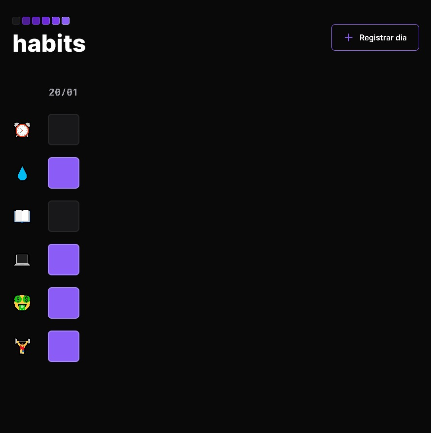

  

## Objetivo

O objetivo desse projeto foi praticar conhecimentos em HTML, CSS e JavasCript para construir uma aplicação na WEB que simulasse um <b>controlador de hábitos</b>. Utilizei como base para isso o mini curso DevLinks da <a href="https://www.rocketseat.com.br" style="color: #8257E5" target="_blank" >RocketSeat</a>.

As informações são armazenadas no localStorage, ficando os dados salvos no navegador e podendo ser resgatados mesmo após atualizar a página.

## Tecnologias

Esse projeto foi desenvolvido com as seguintes tecnologias:

- HTML e CSS
- JavaScript
- Git e Github
- Figma

## Visite meu projeto!

Acesse o site <a href="https://ricardoddev.github.io/habits/" target="_blank" style="color: #8257E5">aqui</a>.
